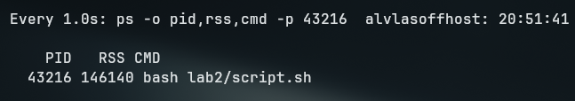
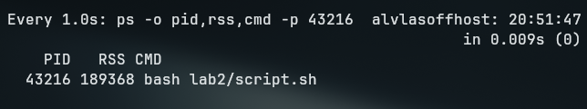

## Lab 2

1. Пишем небольшой скрипт, который имитирует утечку памяти, запускаем и смотрим на потребление:

```
watch -n 1 "ps -o pid,rss,cmd -p $(pgrep -f script.sh)"
```





Видно что спустя 6 секунд ушло ~43Мб памяти

2. Используем небольшую программу на C, которая спровоцирует создание зомби процесса, т.е. выполневшегося, но ждущего чтобы родитель прочитал его код статуса

За ним можно понаблюдать:

```
F S   UID     PID    PPID  C PRI  NI ADDR SZ WCHAN  TTY          TIME CMD
1 Z  1000   46868   46867  0  80   0 -     0 -      pts/0    00:00:00 zombie <defunct>
```

3. Создаем задачи-примеры:

Резервное копирование:

```
0 2 * * * tar -czf /backup/data_$(date +\%F).tar.gz /home/user/data
```

Очистка временных файлов старше дня:

```
01 * * * * find /tmp/myapp -type f -mtime +1 -delete
```

Перезапуск службы (требует `sudo crontab -e`):

```
30 3 * * 0 systemctl restart rsyslog
```

Все файлы попадают в /var/spool/cron/crontabs в директорию по имени пользователя, создавшего правило

4. Пишем скрипт для сложения полей:

```bash
#!/bin/bash

VSZ_TOTAL=0
RSS_TOTAL=0

while read -r pid comm vsz rss; do
    if [[ "$comm" == "$1" || "$pid" == "$1" ]]; then
        ((VSZ_TOTAL+=vsz))
        ((RSS_TOTAL+=rss))
    fi
done < <(ps -eo pid,comm,vsz,rss | tail -n +2)

echo "VSZ: $VSZ_TOTAL KB"
echo "RSS: $RSS_TOTAL KB"
echo "ИТОГО: $((VSZ_TOTAL + RSS_TOTAL)) KB"
```

Данные поля отличаются тем, что VSZ это сколько процесс зарезервировал памяти, включая не используемую, а RSS - эта вся память используемая процессом без учета кэша и swap
