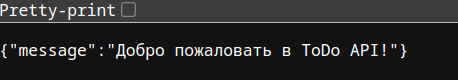

## Lab 3

1. Создаем простое приложение с применением FastAPI (program.py)

2. Пишем докер файл чтобы создать образ с приложением:

```
FROM python:3.11-alpine

WORKDIR /app

COPY program.py .

RUN pip install fastapi uvicorn pydantic

CMD ["uvicorn", "program:app", "--host", "0.0.0.0", "--port", "8000", "--reload"]
```

3. Собираем образ:

```
docker build -t fastapi -f dockerfile .
```

4. Запускаем, пробрасывая порты:

```
docker run -p 127.0.0.1:8000:8000 -d --name fastapi fastapi:latest
```

5. Теперь в браузере (или через curl) можно получить ответ:


